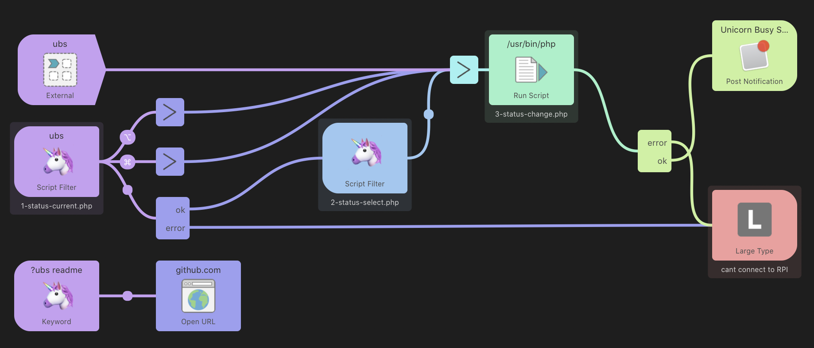
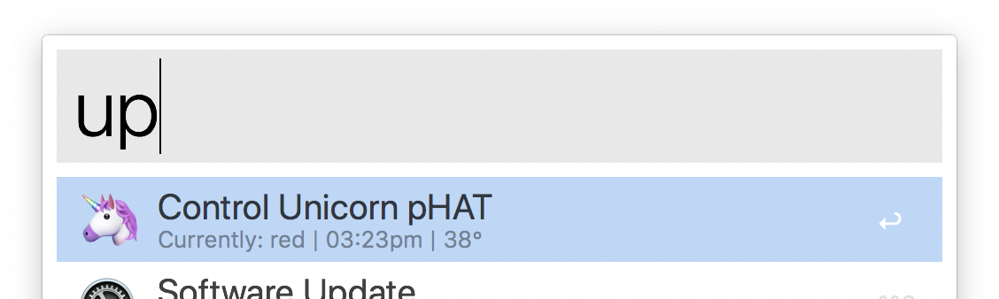
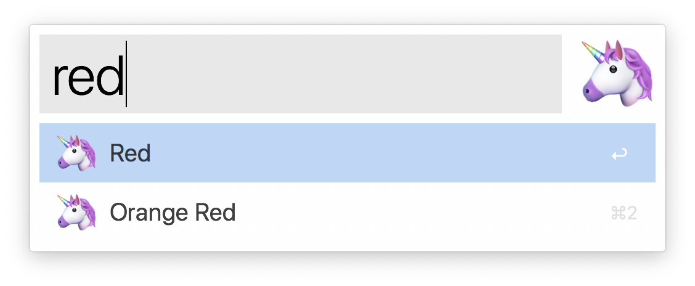
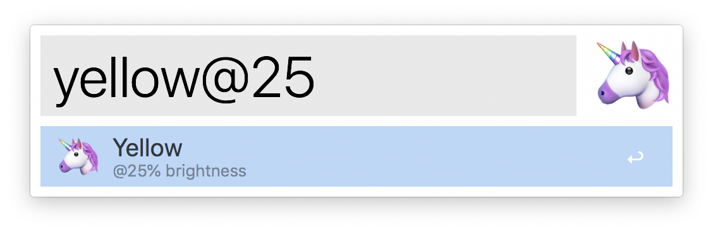

# 🦄 Alfred Unicorn pHAT

Alfred Workflow to view status of and modify display of a [Pimoroni Unicorn pHAT](https://shop.pimoroni.com/products/unicorn-phat) using [unicorn-busy-server](https://github.com/estruyf/unicorn-busy-server/) on a Raspberry Pi.



## Setup

- Requires [unicorn-busy-server](https://github.com/estruyf/unicorn-busy-server/) server running on a Raspberry Pi w/ a [Pimoroni Unicorn pHAT](https://shop.pimoroni.com/products/unicorn-phat)
- Download Workflow from [Releases](https://github.com/davidsword/alfred-unicorn-phat/releases) tab and install into Alfred
- Set variables
  - `RPI_UNICORN_PHAT_BRIGHTNESS` an interger for default brightness, between `1`-`100`
  - `RPI_UNICORN_PHAT_URL` the local IP address of your rpi with the port and no trailing slash

## Usage

Keyword trigger

- `up` view status `<current nearest colour> | <last time updated> | <rpi cpu temp>`
  - `⌅` to enter the change colour filter
  - `⌘` to turn on
  - `⌘⇧` to turn off



Once in the colour change filter:

* `<colourName>` - to select a predefined common colour, ie: `red`, `green`
* `<colourName>@<brightness>` - to turn set brightness ie: `blue@40`, `yellow@90`






## Integration

Use external trigger to use workflow to control colours of Unicorn pHAT:

```
tell application id "com.runningwithcrayons.Alfred" to run trigger "up" in workflow "com.davidsword.alfredunicornphat" with argument "red@75"
```

## TODO

- [ ] support for setting display via hex colour, ie `up > #c0ffee@99`

## Notes

* The unicorn-busy-server works off of rgb, however as a web developer I felt hex and [CSS colours names](https://www.w3schools.com/colors/colors_names.asp) is more common, so that's the primary useage here.
* [`colour-lib--full.php`](colour-lib--full.php) includes more colours, swap out for a bigger library.
