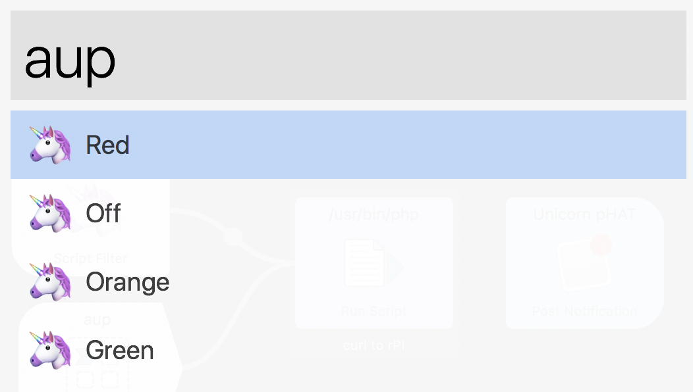
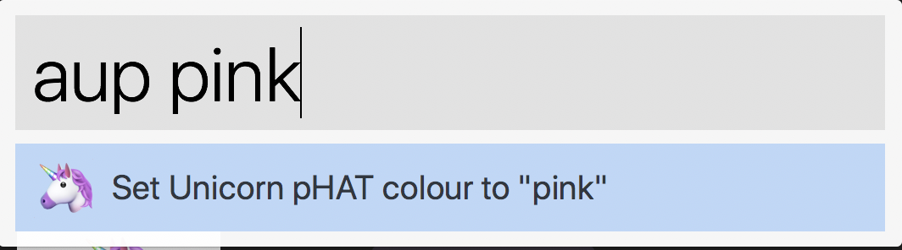

# 🦄 Alfred Unicorn pHAT

Alfred Workflow to change colour of Raspberry Pi running [node-unicorn](https://github.com/davidsword/node-unicorn) to control display of [Pimoroni Unicorn pHAT](https://shop.pimoroni.com/products/unicorn-phat).



Comes preloaded with standard colours for "busy", "away", and "active" status'.

Use "off" to turn off, or type your own custom colours:



Biggest potential of this workflow is the External Webhook. Using applescript you can trigger a lightchange from any workflow, cronjob, ect:

```osascript
tell application id "com.runningwithcrayons.Alfred" to run trigger "aup" in workflow "com.davidsword.alfredunicornphat" with argument "red"
```
