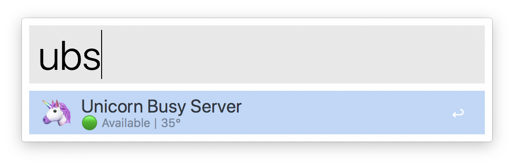
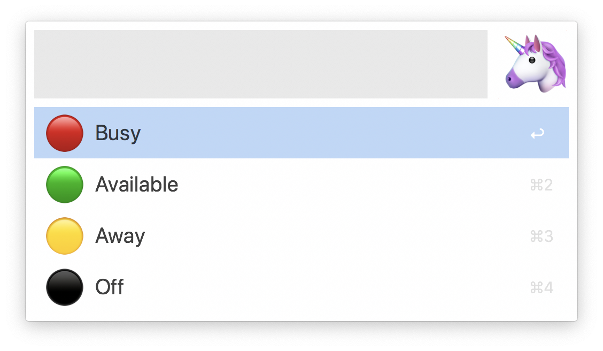

# 🦄 Alfred Unicorn Busy Server

Alfred Workflow to manage status of a [unicorn-busy-server](https://github.com/estruyf/unicorn-busy-server/).


## Setup

1. Requires **@estruyf** 's [unicorn-busy-server](https://github.com/estruyf/unicorn-busy-server/) server running on a Raspberry Pi w/ a [Pimoroni Unicorn pHAT](https://shop.pimoroni.com/products/unicorn-phat)
2. Download latest Workflow from [Releases](https://github.com/davidsword/alfred-unicorn-busy-server/releases)	 tab and install into Alfred
3. Set variables
  - `UBS_BRIGHTNESS` a float for default brightness, between `0.2`-`0.5`
  - `UBS_ADDRESS` the address of your rpi with the port and no trailing slash, example `http://192.0.0.0:5000`

## Usage



- Keyword trigger `ubs` view status
- `⌅` to enter the change status
- `⌘⌅` to quick change status to Busy
- `⌥⌅` to quick change status off




## Integration

Use external trigger to use workflow to control the status:

```applescript
tell application id "com.runningwithcrayons.Alfred" to run trigger "ubs" in workflow "com.davidsword.alfredunicornbusyserver" with argument "Busy"
```

Accepts `Busy`, `Avaliable`, `Away`, `Rainbow`, `Off`

## TODO

- [ ] Brightness isn't respected at the API level
- [ ] Rainbow via this CURL doesn't work on the API, its `500`ing (for me at least)
- [ ] support for the `/api/switch` endpoint, passing in hex colours, ie `ubs #c0ffee`

## Links

* https://www.eliostruyf.com/diy-building-busy-light-show-microsoft-teams-presence/
* https://github.com/estruyf/unicorn-busy-server/
* https://davidsword.ca/slack-busy-light/
